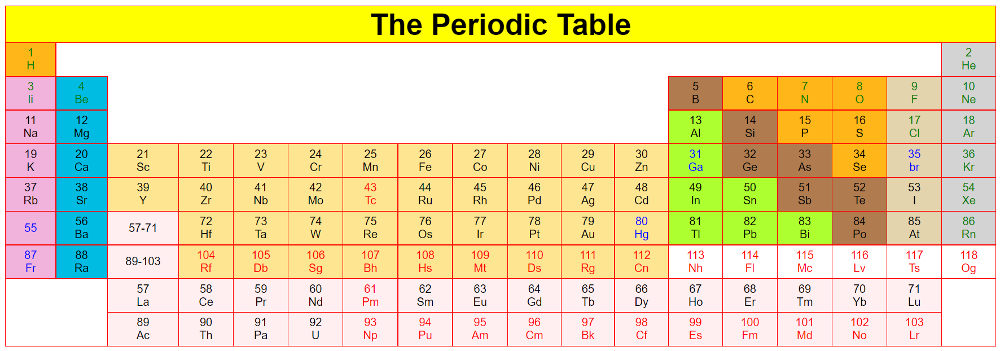

# Graded Projects

### 1. The Periodic Table
  - <strong>Problem Statement:</strong> Create a periodic table using your HTML skills.
  

    

### 2. Animation Assignment
  - <strong>Problem Statement:</strong> Create an attractive simple login html page , where the input boxes have a css hover effect to enhance the user interface of the login page.
  - The submit button of the login page should be followed by a simple loading spinner , with a text saying waiting for the network.

  <strong>Note:</strong>
  - Input boxes must have hover effects on them.
  - There should be a simple loading spinner with text below it stating “waiting for the network.”
  

  

### 3. Restaurant Service Page Assignment

#### Problem Statement:

> Create a restaurant service page by using your knowledge of HTML and CSS.
> The service page will contain Header with tabs containing information like home, menu and others.
> The header will contain contact information through gmail and other social media information.
> The service page may also contain images related to the main product of the restaurant and some other information.

For more information , a figma design has been attached for your reference.
https://www.figma.com/file/lhWKzYGoCKtte9wYbE8sOq/Assignment-Batch-8?node-id=0%3A1&t=KAT8sYpRq43OTl7R-3